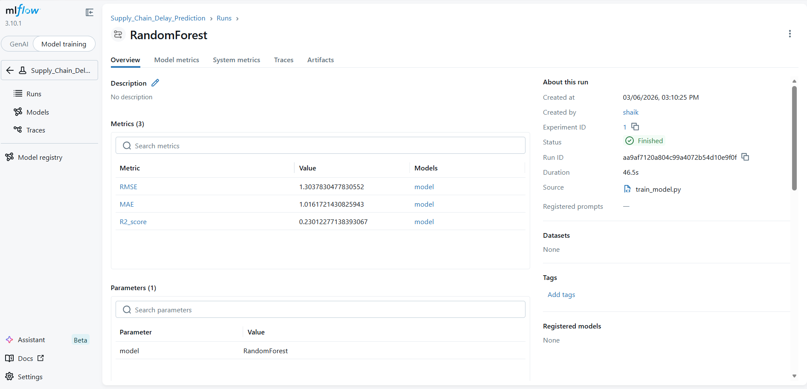
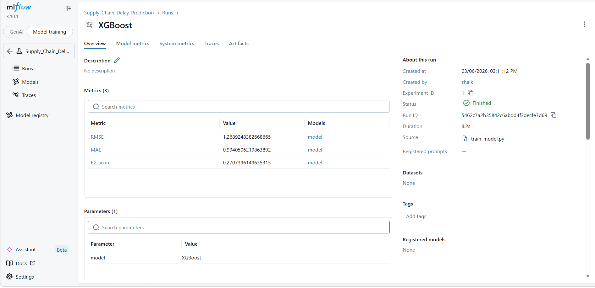
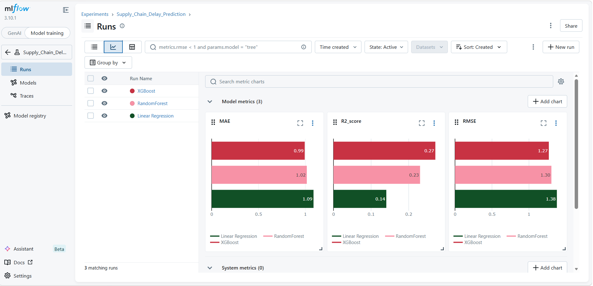
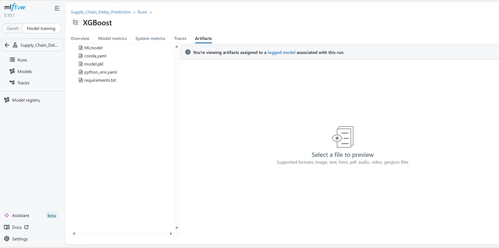
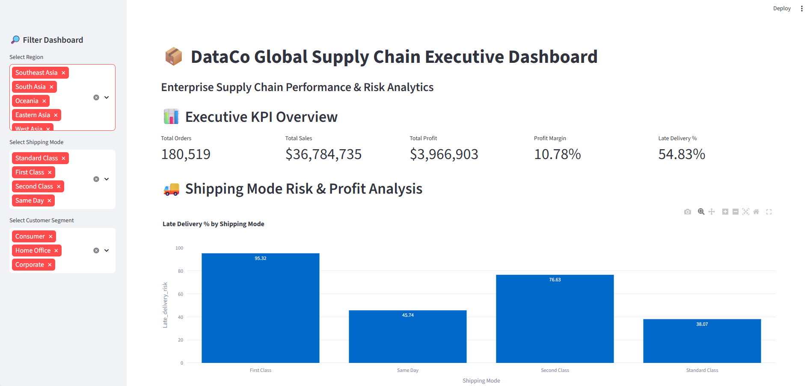
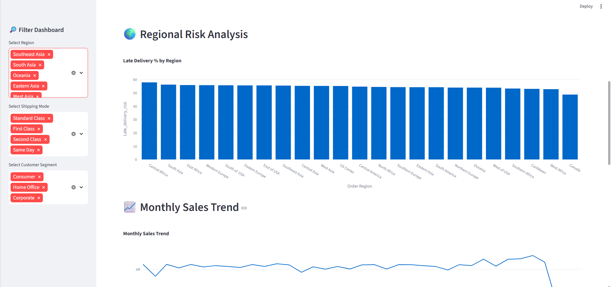
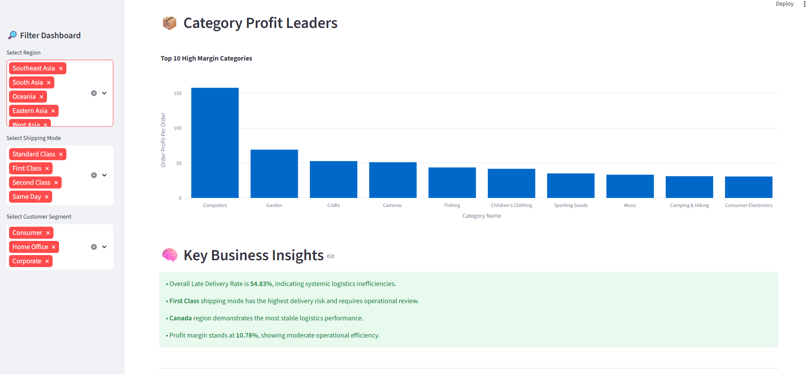
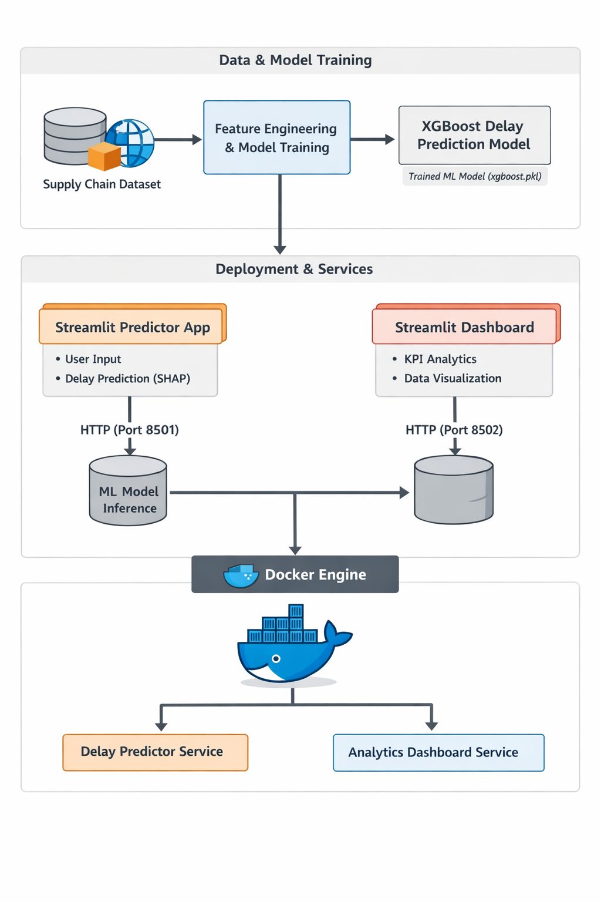

# 🚚 Supply Chain Delivery Delay Prediction System

---

## 📊 End-to-End Machine Learning System for Predicting Supply Chain Delivery Delays

This project presents a **complete machine learning pipeline** for predicting supply chain delivery delays using advanced ML models, experiment tracking, explainability techniques, and interactive dashboards.

The system includes:

• Data preprocessing and feature engineering  
• Exploratory Data Analysis (EDA)  
• Multiple machine learning models  
• Model evaluation using RMSE, MAE, and R²  
• Experiment tracking using MLflow  
• API-based prediction service  
• Streamlit interactive dashboard  
• Docker containerization  

---

## 📌 Project Overview

This project builds an **end-to-end Machine Learning system** to predict **shipping delays in supply chain operations** using historical logistics data.

The system includes:

- Data preprocessing and feature engineering
- Machine learning model training
- Experiment tracking
- Model explainability
- Interactive web applications
- Containerized deployment

The goal is to help businesses **identify factors that cause shipment delays and improve supply chain planning**.

---

# ⭐ Project Highlights

✔ End-to-end **Machine Learning System** for supply chain delay prediction  
✔ **Three ML models compared** (Linear Regression, RandomForest, XGBoost)  
✔ **Model explainability using SHAP**  
✔ **Experiment tracking with MLflow**  
✔ **Interactive Streamlit applications**  
✔ **Docker containerized microservices architecture**  
✔ **Production-ready project structure**

---

# 🎯 Business Problem

Shipping delays are a major issue in supply chain operations and can lead to:

- Increased logistics costs
- Customer dissatisfaction
- Inventory planning issues
- Operational inefficiencies

This project predicts **how many days a shipment will be delayed** based on order and shipping features.

---

# 📊 Dataset

Dataset used:

**DataCo Global Supply Chain Dataset**

Key features used:

| Feature | Description |
|------|-------------|
| Shipping Mode | Type of shipment |
| Customer Segment | Category of customer |
| Order Region | Region where order originated |
| Order Item Quantity | Quantity ordered |
| Sales | Total order sales |
| Days for shipment (scheduled) | Planned shipping duration |

Target variable:
Shipping_Delay = Days for shipping (real) - Days for shipment (scheduled)

---

# 🧠 Machine Learning Pipeline

### 1️⃣ Data Preprocessing

Steps performed:

- Feature selection
- Encoding categorical features
- Train-test split
- Feature preparation for modeling

---

### 2️⃣ Models Trained

Three machine learning models were trained and compared:

| Model | Purpose |
|------|---------|
| Linear Regression | Baseline model |
| RandomForest Regressor | Ensemble tree model |
| XGBoost Regressor | Gradient boosting model |

---

### 3️⃣ Model Evaluation

Models were evaluated using:

- RMSE (Root Mean Squared Error)
- MAE (Mean Absolute Error)
- R² Score

Example results:

| Model | RMSE | MAE | R² |
|------|------|------|------|
| Linear Regression | 1.37 | 1.08 | 0.14 |
| RandomForest | 1.30 | 1.01 | 0.23 |
| XGBoost | **1.26** | **0.99** | **0.27** |

Best performing model:
XGBoost Regressor

---

# 🔍 Model Explainability

Model predictions are explained using **SHAP (SHapley Additive Explanations)**.

This allows users to understand:

- Feature importance
- How each feature affects delay prediction
- Model transparency

Example insights:

- Sales value impacts delay probability
- Order quantity influences shipment time
- Shipping mode affects delivery speed

---

# 📈 Experiment Tracking with MLflow

This project uses **MLflow** to track machine learning experiments, compare model performance, and store trained models.

MLflow enables:

- Tracking model parameters
- Logging evaluation metrics
- Comparing multiple model runs
- Storing trained model artifacts
- Ensuring reproducible ML experiments

---

### 🔎 MLflow Experiment Dashboard

The MLflow UI shows all training runs and experiment history.

---

### 📊 Model Metrics Comparison

Performance metrics such as **RMSE, MAE, and R² score** are logged for each model run.

---

### 📦 Model Artifacts

MLflow also stores trained model artifacts including model files, environment configurations, and metadata.

---

# 🖥️ Applications

Two **Streamlit applications** were built.

### 1️⃣ Delay Prediction App

Features:

- User input interface
- Shipping delay prediction
- SHAP explainability

Port:8501

---

### 2️⃣ Supply Chain Analytics Dashboard

Features:

- KPI analytics
- Delay distribution
- Sales analysis
- Operational insights

Port:8502

---
---

# 📸 Application Screenshots

### 🚚 Delay Prediction App

Users can enter order details and receive a predicted shipping delay along with SHAP feature contributions.

---

### 📊 Supply Chain Analytics Dashboard

Interactive dashboard showing supply chain analytics and operational insights.

---

# 🐳 Containerization

The project is containerized using **Docker**.

Two services are created:
Delay Predictor Service
Analytics Dashboard Service

Run the project using Docker Compose:
docker compose up --build

Applications will run at:
Predictor → http://localhost:8501
Dashboard → http://localhost:8502
---

# 🏗️ Production Architecture

Pipeline overview:
Dataset
↓
Feature Engineering
↓
Model Training
↓
Experiment Tracking (MLflow)
↓
Prediction API
↓
Streamlit Applications
↓
Docker Containers
↓
Deployment

---

# 📂 Project Structure

ShaikAbdulShahansha-supply-chain-capstone
│
├── docker-compose.yml
├── requirements.txt
├── README.md
│
├── api
│ └── main.py
│
├── app
│ └── app.py
│
├── architecture
│ └── Architecutre.png.png
│
├── dashboards
│ └── streamlit_dashboard
│ ├── app.py
│ └── requirements.txt
│
├── data
│ ├── raw
│ │ └── DataCoSupplyChainDataset.csv
│ │
│ └── processed
│ └── cleaned_supply_chain.csv
│
├── deployment
│ ├── Dockerfile_dashboard
│ └── Dockerfile_predictor
│
├── docs
│ ├── business_risk_assessment.pdf
│ ├── explainability_report.pdf
│ ├── insight_summary.md
│ ├── executive_presentation.pdf
│ └── model_evaluation_report.pdf
│
├── models
│ ├── final_supply_chain_model.pkl
│ └── supply_chain_delay_model.pkl
│
├── notebooks
│ ├── 01_eda_analytics.ipynb
│ ├── 02_predictive_modeling.ipynb
│ └── 03_ml_modeling.ipynb
│
└── src
├── train_model.py
├── explain_model.py
└── mlruns

---

# 🚀 Running the Project

Install dependencies:
pip install -r requirements.txt

Train the model:
python src/train_model.py

Start MLflow UI:
mlflow ui

Run predictor app:
streamlit run app/app.py

Run dashboard:
streamlit run dashboards/streamlit_dashboard/app.py

---

## ☁️ Deployment

This system is fully containerized using **Docker**, making it portable and easy to deploy on various cloud platforms.

Potential deployment platforms include:

- Render
- Railway
- Google Cloud
- AWS

The application architecture is designed to support scalable cloud deployment using containerized services.

### Current Deployment Status

At present, the project is being executed in a **local containerized environment** using **Docker Compose**.  
This setup allows the prediction API and Streamlit dashboard to run as independent services while ensuring reproducibility and ease of development.

Cloud deployment has been deferred temporarily as other services (such as the Text-to-SQL system) are currently running in the available free-tier environment.

However, the system is **fully deployment-ready** and can be migrated to any supported cloud platform with minimal configuration.

# 🛠️ Tech Stack

- Python
- Pandas
- Scikit-learn
- XGBoost
- MLflow
- SHAP
- Streamlit
- Docker
- Docker Compose

---

# 👨‍💻 Author

**Shaik Abdul Shahansha, MCA., B.Sc**

AI / Machine Learning Enthusiast

LinkedIn: https://www.linkedin.com/in/shaheensha-shaik-9b7a8b225  
GitHub: https://github.com/Shaheensha21

---

# ⭐ Future Improvements

- CI/CD pipeline
- Kubernetes deployment
- Real-time model monitoring
- Automated model retraining

  

